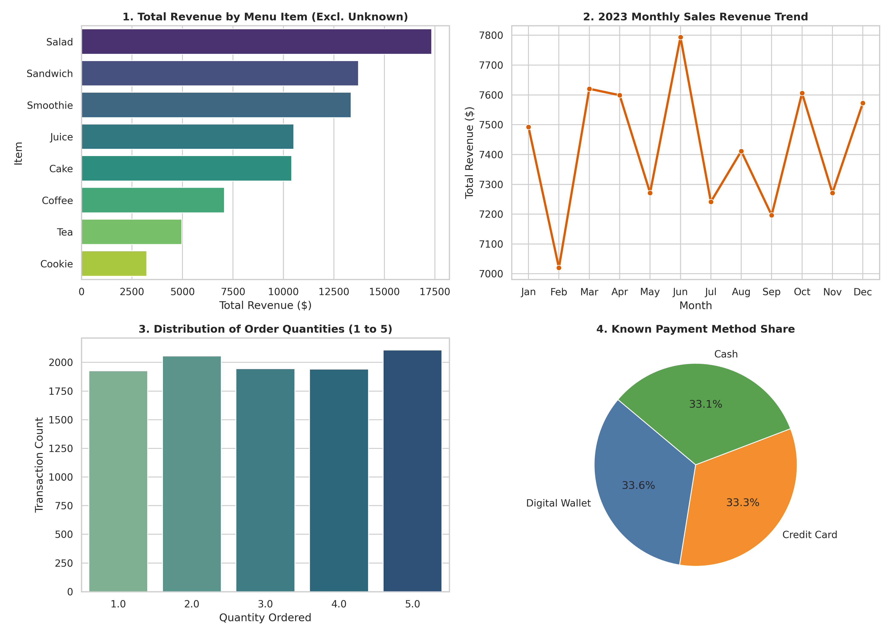

# SWYNEX - Exploratory Data Analysis (Task 2)

## Overview
This repository contains the complete exploratory data analysis (EDA) pipeline for **Task 2: Exploratory Data Analysis** of the SWYNEX Technologies Data Analytics Internship. 

The objective is to analyze the cleaned point-of-sale dataset (`cleaned_cafe_sales.csv`) produced in Task 1, compute descriptive statistics, examine underlying behavioral distributions, and derive at least five actionable business insights accompanied by visual charts.

---

## Dataset Description
- **Records:** 10,000 completed cafe transaction records spanning January 1, 2023 to December 31, 2023.
- **Attributes Analyzed:** `Transaction ID`, `Item`, `Quantity`, `Price Per Unit`, `Total Spent`, `Payment Method`, `Location`, `Transaction Date`.
- **Engineered Fields:** Extracted `Month_Num`, `Month_Name`, and `DayOfWeek` from transaction timestamps for temporal seasonality checks.

---

## Key Descriptive Statistics

| Metric | Quantity | Price Per Unit ($) | Total Spent ($) |
| :--- | :--- | :--- | :--- |
| **Count** | 10,000 | 10,000 | 10,000 |
| **Mean** | 3.02 | $2.95 | $8.93 |
| **Standard Deviation** | 1.42 | $1.28 | $6.00 |
| **Minimum** | 1.00 | $1.00 | $1.00 |
| **25th Percentile (Q1)** | 2.00 | $2.00 | $4.00 |
| **50th Percentile (Median)** | 3.00 | $3.00 | $8.00 |
| **75th Percentile (Q3)** | 4.00 | $4.00 | $12.00 |
| **Maximum** | 5.00 | $5.00 | $25.00 |

---

## 5 Actionable Business Insights

### 1. High-Margin Salad is the Top Revenue Driver
* **Observation:** Salad generated the highest cumulative revenue ($17,375.00 across 3,475 units), outpacing Sandwiches ($13,764.00) and Smoothies ($13,368.00).
* **Insight:** Because Salad commands a $5.00 unit price, it yields the highest average order value ($15.14 per ticket). Marketing premium fresh meals yields significantly higher margins than pushing snacks.

### 2. High Unit Volume vs. Low Revenue Yield for Coffee
* **Observation:** Coffee recorded the highest raw quantity sold across all items (3,551 units across 1,165 orders), but ranked 6th out of 8 in total revenue ($7,102.00).
* **Insight:** Coffee operates as a foot-traffic driver rather than a basket builder. Introducing a combined morning bundle (e.g., Coffee + Sandwich combo) would directly increase the ticket value of high-frequency beverage buyers.

### 3. Mid-Year Seasonality Peak in June
* **Observation:** Total monthly sales averaged $7,442.00 throughout 2023. Sales hit an annual peak in **June ($7,799.50)** and dropped to an annual low in **February ($7,032.00)**.
* **Insight:** Warmer mid-year months demonstrate increased customer spending, whereas February shows lower volume due to shorter operational days and post-holiday lulls. Promotional campaigns and targeted seasonal offerings should be deployed during Q1 to smooth revenue variability.

### 4. Perfectly Uniform Order Quantity Distribution
* **Observation:** Item purchase quantities from 1 to 5 units are distributed with near-perfect uniformity (1 unit: 1,922; 2 units: 2,051; 3 units: 1,967; 4 units: 1,939; 5 units: 2,121).
* **Insight:** The cafe experiences an identical demand pattern for single-item grab-and-go purchases and multi-item group/catering orders, requiring balanced prep planning for both single servings and bulk packaging.

### 5. Equidistributed Payment Method Adoption
* **Observation:** Known transactions showed an exact three-way split: **Digital Wallets (33.6%)**, **Credit Cards (33.3%)**, and **Cash (33.1%)**.
* **Insight:** Customers do not lean towards a single payment mechanism. Modern POS terminals supporting contactless digital payments are just as vital to business operations as cash handling capacity.

---

## Visualizations & Dashboard



1. **Total Revenue by Menu Item:** Ranked bar plot showcasing item revenue hierarchy from Salad down to Cookie.
2. **2023 Monthly Sales Revenue Trend:** Chronological line chart highlighting seasonal revenue shifts.
3. **Distribution of Order Quantities:** Frequency breakdown demonstrating uniform distribution across order sizes.
4. **Known Payment Method Share:** Proportional pie chart detailing the even three-way payment balance.

---

## Repository Structure

```text
SWYNEX-Data-Analysis/
├── README.md
├── Task-1-Data-Cleaning-Preparation/
│   ├── Clean_Cafe_Sales.ipynb
│   ├── dirty_cafe_sales.csv
│   └── cleaned_cafe_sales.csv
└── Task-2-Exploratory-Data-Analysis/
    ├── README.md
    ├── Exploratory_Data_Analysis.ipynb
    ├── eda_analysis.py
    └── eda_summary_charts.png