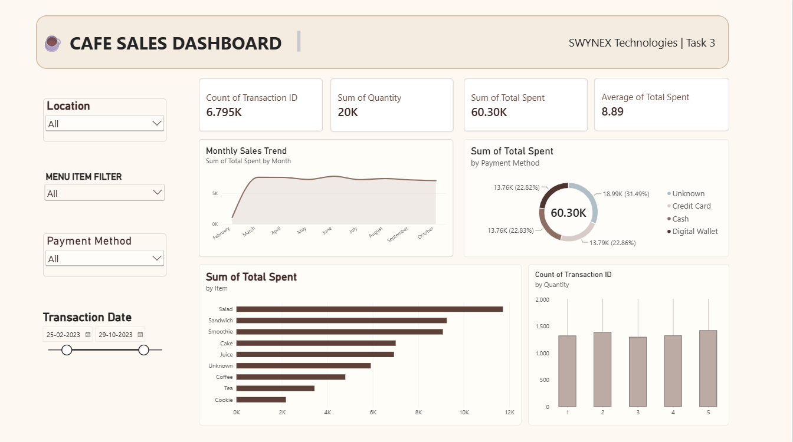

# Task 3: Interactive Power BI Dashboard

Part of the **SWYNEX Technologies Data Analytics Internship** program.

---

## 📌 Project Overview
This project delivers an interactive, executive-grade business intelligence dashboard developed in **Power BI Desktop**. Using the sanitized 10,000-transaction cafe sales dataset (`cleaned_cafe_sales.csv`) produced in Task 1, the dashboard enables stakeholders to track high-level retail KPIs, drill into item-level revenue contributions, evaluate payment preferences, and monitor temporal seasonality across custom date intervals.

---

## 🎯 Executive Key Performance Indicators (Baseline)

| Metric Card | Value | Aggregation / Logic |
| :--- | :--- | :--- |
| **Total Revenue** | **$89.30K** ($89,304.50) | Sum of `Total Spent` |
| **Total Orders** | **10K** (10,000) | Distinct Count of `Transaction ID` |
| **Units Sold** | **30K** (30,249) | Sum of `Quantity` |
| **Average Order Value (AOV)** | **$8.93** | Average of `Total Spent` |

---

## 🔍 Interactive Slicers & Dynamic Cross-Filtering

The dashboard includes 4 responsive slicers that update all KPI cards and charts in real time:

1. **Location Slicer:** Filter across *In-store*, *Takeaway*, and *Unknown*.
2. **Menu Item Filter:** Isolate sales for single menu offerings (*Salad*, *Sandwich*, *Coffee*, *Juice*, *Cake*, *Smoothie*, *Tea*, *Cookie*).
3. **Payment Method Slicer:** Drill down into *Cash*, *Credit Card*, *Digital Wallet*, and *Unknown*.
4. **Transaction Date Slider:** Interactive range selector across the 365-day operational period (01/01/2023 – 31/12/2023).

---

## 📊 Core Visual Components

* **Horizontal Bar Chart (`Total Revenue by Item`):** Ranks sales performance across menu items. Identifies Salad as the primary revenue generator ($17.4K), followed by Sandwiches ($13.8K) and Smoothies ($13.4K).
* **Area Trend Chart (`Monthly Sales Trend`):** Displays 2023 monthly revenue volume with shaded area fills, capturing mid-year peaks in June ($7.8K) and seasonal dips in February ($7.0K).
* **Donut Chart (`Revenue Share by Payment Method`):** Visualizes transaction shares across Digital Wallet, Credit Card, Cash, and Unknown payment modes.
* **Column Chart (`Count of Transactions by Quantity`):** Highlights customer basket sizing, showing uniform distribution across 1 to 5 item purchases (~2,000 orders each).

---

## 🖼️ Dashboard Preview



---

## 🚀 How to Open and Review

1. Clone the repository:
   ```bash
   git clone [https://github.com/hari2007sm/SWYNEX-Data-Analysis.git](https://github.com/hari2007sm/SWYNEX-Data-Analysis.git)
   cd SWYNEX-Data-Analysis/Task-3-Analysis-Dashboard